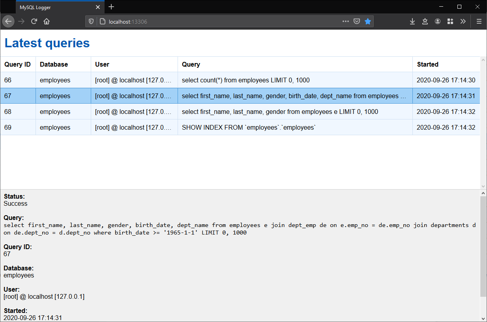

MySQL Logger
============

[](https://travis-ci.com/sryze/mysql-logger)

MySQL Logger is a server-side plugin for MySQL/MariaDB that allows you to see
what SQL queries are executed by your server in real time inside a web browser.

**PLEASE DO NOT USE IN PRODUCTION**



Installation
------------

1. Build with CMake
2. Copy logger.so/.dll to the plugins directory of your MySQL/MariaDB server
3. Register the plugin:

   ```sql
   install plugin logger soname 'logger.so'
   ```

4. Restart the server and connect to http://yourserver:13306

License
-------

MIT license. See [LICENSE.txt](LICENSE.txt) for details.
